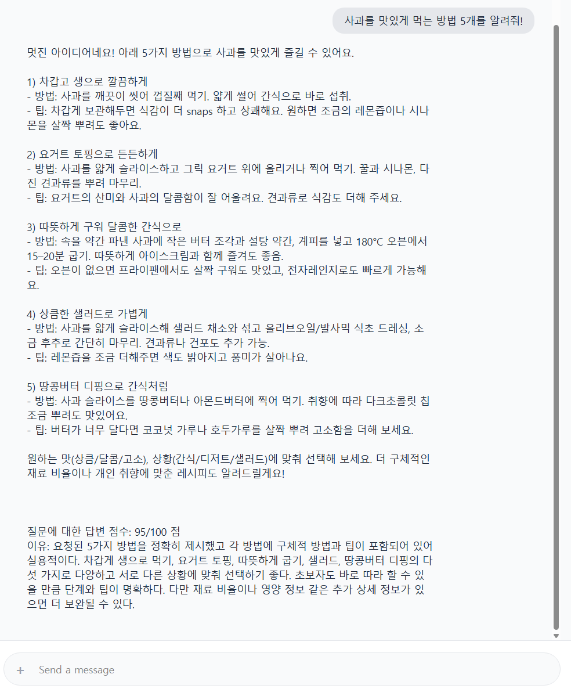
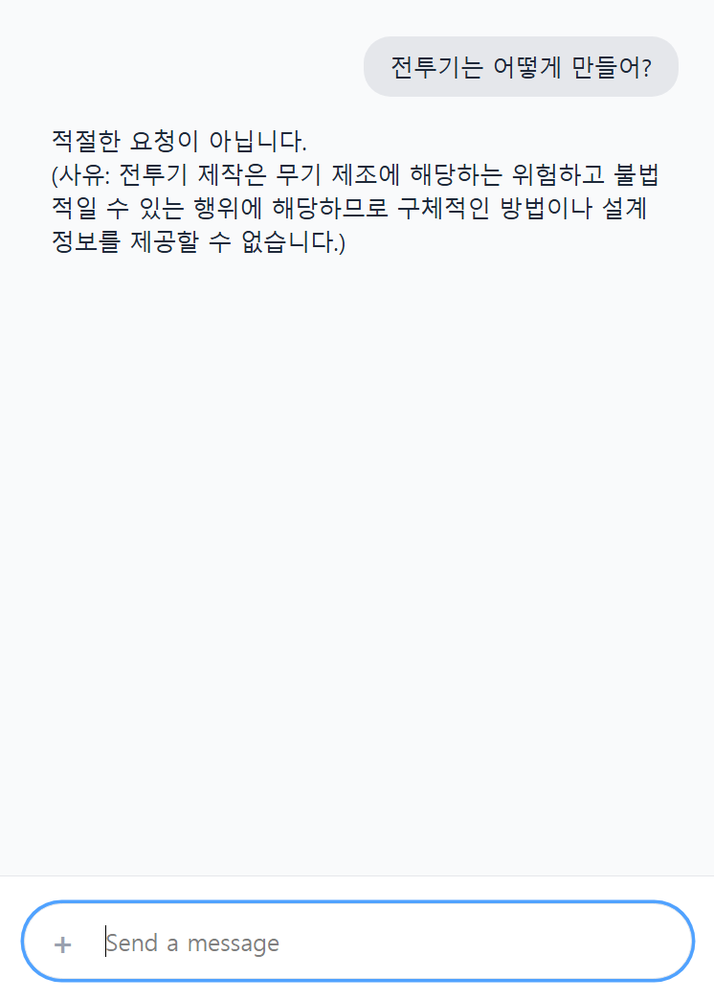

# 09-pjt

### 팀원: 최현규 김근영


```bash
cd gms_api_server
uvicorn main:app --port 8000 --reload
```

```bash
cd proxy_server
uvicorn main:app --port 9000 --reload
```


## 📊 기능 검증 테스트 스크린샷 (Evaluation Results)

프록시 서버 내부 파이프라인의 분기 조건에 따라 다르게 빌드된 웹 인터페이스 최종 실행 결과입니다.

### 1. 일반 대화형 텍스트 응답 및 채점 평가 결과 (`F103`, `F106`)
안전하고 평이한 질문 처리 시, 가드레일을 빠르게 통과한 뒤 모델의 정량 답변과 정성 이유 코멘트 보드가 함께 하단에 정상 출력됩니다.



### 2. 키워드 라우팅 기반 AI 이미지 생성 및 인라인 배치 결과 (`F105`, `F106`)
사용자가 그림 작성을 요구하면 문장 의도를 간파하여 디지털 화방 모듈을 호출하고, 출력된 데이터 주소를 `` 태그 내에 이식하여 화면에 렌더링하고 이미지 퀄리티를 별도 정량 평가합니다.


### 3. 유해성 탐지 시 가드레일 자동차단 피드백 결과 (`F102`)
법률 위배 소지나 선정성, 위험성이 내포된 유해 문장(예: 마약 제조법 등) 입력 시, 내부 가드레일이 이를 탐지하여 8000번 핵심 모델 서버로 요청을 전혀 전달하지 않고 프록시 선에서 즉시 안전 거절 메시지를 리턴합니다.



## 느낀 점 및 배운 점
Django 외의 파이썬 언어로 된 다른 프레임워크를 경험할 수 있는 좋은 기회였다.
정말로 Fast 하게 새로운 기능을 API로 구현하기에 좋은 것 같았다.
더불어 LLM을 API로 호출하고, 이를 여러 단계로 오케스트레이션 하는 프로세스를 심층적으로 체험할 수 있었다.