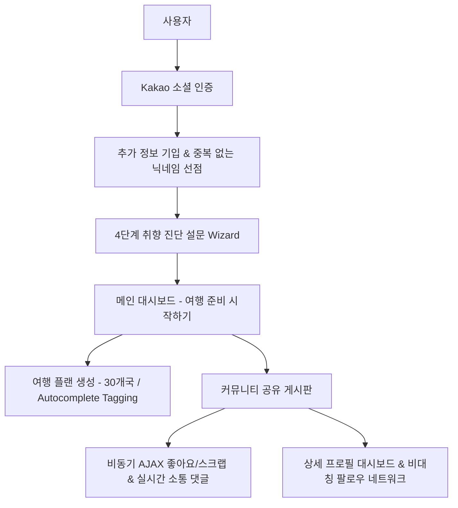

# 09-pjt
### 👥 팀원: 최현규, 김근영
### ✈️ 주제: 자율 (여행 준비물 추천 프로젝트 - "야무짐")

---

# 🛫 야무짐 (YAMUZIM) - 여행 준비물 & 취향 맞춤 소셜 플래너

**야무짐**은 사용자의 **여행 성향 및 라이프스타일**을 다차원적으로 진단하고, 이를 기반으로 **완벽히 개인화된 여행 준비물 추천 및 여정 공유 소셜 네트워크**를 구축하는 프리미엄 웹 어플리케이션입니다.

글라스모피즘과 네온 테마의 수려한 현대적 인터페이스, 쾌적하고 인터랙티브한 반응형 UX 모션 디자인을 적용하여 사용자에게 최고의 pair-planning 경험을 제공합니다.

---

## 🏗️ 전체 시스템 아키텍처 (System Architecture)



---

## ⚡ 주요 구현 단계 및 세부 기능 명세 (Implementation Phases)

### Phase 1. 소셜 로그인 및 스마트 온보딩 (Accounts)
* **Kakao OAuth 2.0 연동**: 번거로운 입력 없이 카카오 간편 로그인으로 신속하게 가입합니다.
* **추가 프로필 연동 (`additional_info`)**: 로그인 직후, 중복 불가능한 닉네임과 성별, 생년월일을 필수 입력받아 고유 사용자 테이블을 동기화합니다.
* **4단계 취향 진단 위저드 (`preference_step 1~4`)**:
  * **Step 1. 위생 민감도**: 1~10 단계의 슬라이더로 숙소 침구 상태나 샤워 필터 필수 여부를 진단합니다.
  * **Step 2. 상황 대비성**: 1~10 단계의 슬라이더로 꼼꼼한 약품 구비 스타일인지, 현지 조달 즉흥 스타일인지 판별합니다.
  * **Step 3. 선호 관광 스타일**: 가성비, 맛집, 액티비티, 미술관 등 다중 선택 태그 매핑.
  * **Step 4. 선호 입맛 취향**: 한식 고수, 향신료 무관, 찐 로컬 선호 등 다중 선택 태그 매핑.

### Phase 2. 지능형 여행 계획 관리 시스템 (Travel)
* **스마트 자동 완성 셀렉터**: 한국인이 많이 가는 **30대 인기 국가** 및 국가별 **5~10개 주요 도시** 연동.
* **Autocomplete & Dependent Filtering**: 국가를 타이핑하여 입력하거나 검색어로 좁혀서 복수 선택하면, 해당 국가에 속한 도시 목록만 도시 검색창에 의존적으로(Dependent) 로드되어 태그 형태로 다중 선택됩니다.
* **기간 유효성 점검**: 출발일과 도착일 설정 시 오늘 날짜 이후만 선택이 가능하며, 도착일이 출발일 이전으로 지정되지 않도록 프론트엔드 레벨에서 동적 가드 조건을 제어합니다.
* **일정 상태 관리**: 다가오는 미래의 여행과 이미 다녀온 과거의 여행 일정을 날짜 기준으로 자동 파싱하여 정렬합니다.

### Phase 3. 소셜 여정 공유 커뮤니티 (Community Board)
* **일정 자랑하기 포스팅**: 대시보드에 작성해 둔 자신의 실제 여행 계획(`Travel`)을 연동하여 미려한 피드 카드로 자랑합니다.
* **N+1 쿼리 최적화**: 게시판 로딩 성능 극대화를 위해 `prefetch_related` 및 `select_related` 데이터베이스 쿼리를 이중 설계하여 쿼리 실행 속도를 최적화했습니다.
* **실시간 댓글 & 삭제 인터랙션**: 자유로운 조언과 피드백을 나눌 수 있는 소통 공간을 구축하고, 자신이 단 댓글을 지울 때 카드가 서서히 작아지며 날아가는 미려한 삭제 모션을 연계했습니다.

### Phase 4. 반응형 비동기 인터랙션 & 팔로우 인프라
* **비동기 AJAX 리액션 (Fetch API)**:
  * 좋아요와 스크랩 버튼 클릭 시 **웹페이지 리로드 및 지연 없이 비동기 백엔드 통신**으로 상태를 동적 업데이트합니다.
  * 활성화 시 네온 섀도가 번지는 **글로우 펄스(Neon Pulse Shadow) 애니메이션**과 버튼이 순간 축소되었다가 튕겨 나오는 **Click Scale 튕김 모션**을 통해 극한의 만족감을 선사합니다.
* **비대칭 소셜 팔로우 네트워크**:
  * 타인의 게시물 상단 닉네임을 누르면 상세 프로필 대시보드로 이동합니다.
  * **팔로우/팔로잉(Symmetrical=False)** 소셜 그래프를 설계하여 마음에 드는 플래너의 여정을 구독하고, 팔로우 상태에 따라 입체적인 네온 단추 색상이 전환됩니다.
* **사용자 취향 렌더링**: 타인의 프로필 진입 시 해당 유저의 4단계 취향 지표 배지와 공개 타임라인 일정을 깔끔한 카드 그리드로 확인 가능합니다.

---

## 🏃‍♂️ 고품격 UX 트랜지션 연출 디자인 (UX Transition Paradigms)

서비스 성격에 따라 극과 극의 전환 철학을 수립하여 최고의 사용자 만족도를 구현했습니다.

| 영역 | 연출 테마 | 세부 기술 | UX 효과 |
| :--- | :--- | :--- | :--- |
| **온보딩 코스**<br>(회원가입, 취향 설문 1~4) | **몰입감 & 연결성** | `premiumTransition` 오버레이,<br>가로 슬라이드 아웃 (`slide-exit` 600ms) | 단계적 설문 작성의 몰입감을 극대화하고 고유 프로필이 생성되는 고급스러운 기대감을 형성함. |
| **일반 서비스 영역**<br>(메인, 플랜 수립, 커뮤니티 피드) | **초고속 & 0초 대기** | `window.location.href` 즉시 이동,<br>AJAX 비동기 Fetch 통신 | 불필요한 로딩 딜레이를 100% 제거하여 Snappy하고 즉각적인 서핑 성능을 체감하게 함. |

---

## 🎨 기술 스택 및 디자인 언어 (Tech Stack & Design Systems)

* **Back-end**: Python 3.11+, Django 5.2.x, SQLite 3
* **Front-end**: Pure HTML5, Modern Vanilla JS (ES6+)
* **Styling**: Harmony CSS3, Glassmorphism Cards, HSL Neon Palette (Neon Cyan & Electric Purple)
* **APIs & Libraries**: Kakao OAuth REST API, FontAwesome 6+ Pro Icons, Google Fonts (Outfit, Inter)

---

## ⚙️ 실행 및 빌드 환경 가이드 (Quick Start)

### 1. 가상환경 및 패키지 설치
```bash
# 가상환경 활성화 (Windows PowerShell 기준)
.\venv\Scripts\Activate.ps1

# 의존성 패키지 설치
pip install django python-dotenv
```

### 2. 데이터베이스 초기화 및 성향 초기 데이터 적재
```bash
# 데이터베이스 마이그레이션 적용
python manage.py makemigrations
python manage.py migrate

# 개발 서버 가동
python manage.py runserver
```

---
*Powered by YAMUZIM Premium Onboarding Engine.*