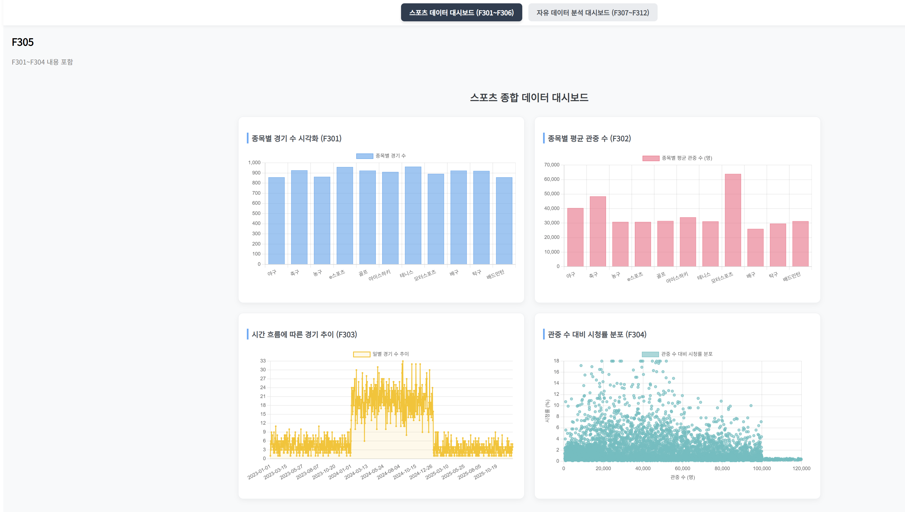
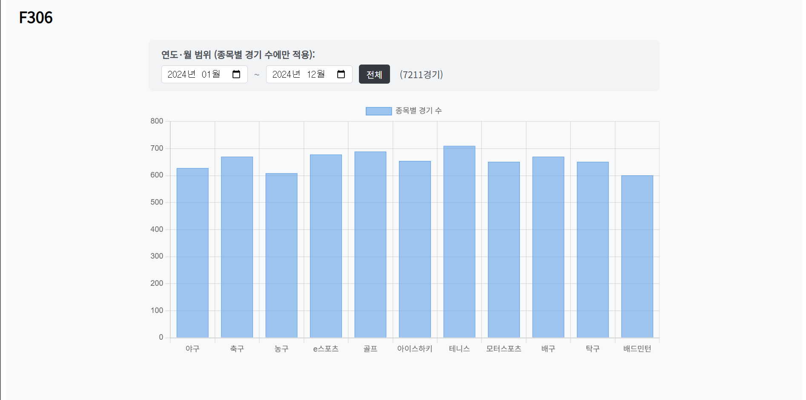
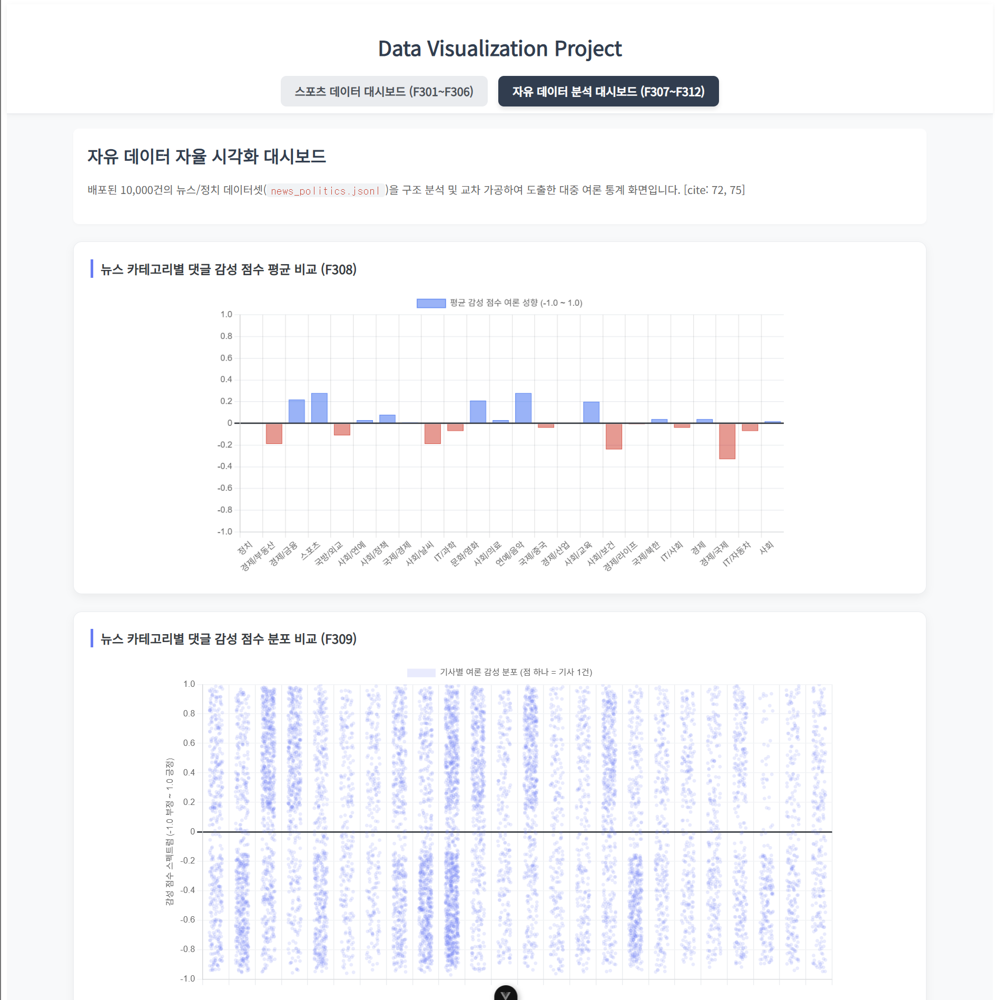
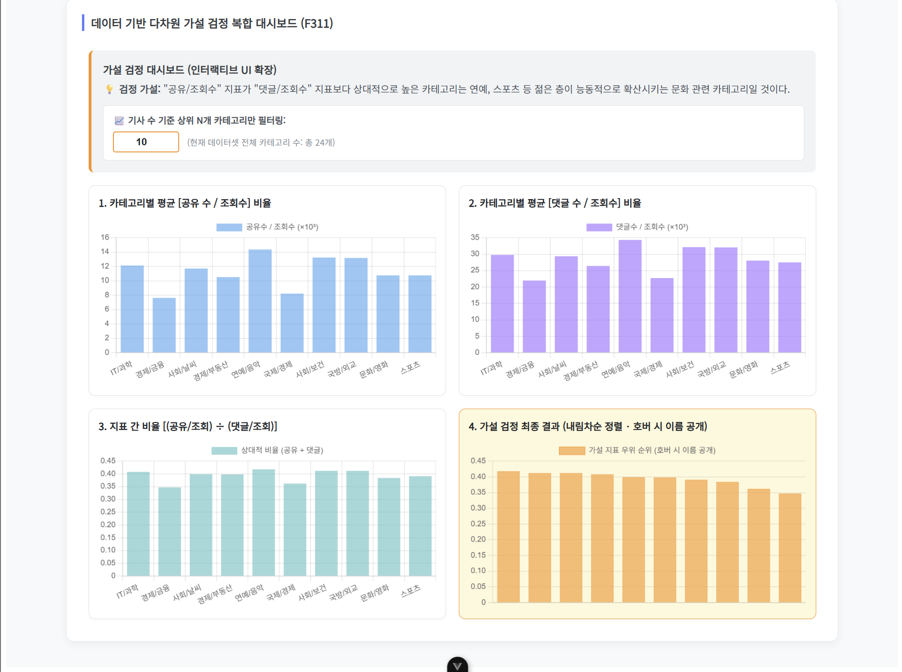

# 📊 대규모 데이터 시각화 및 인터랙티브 대시보드 프로젝트

본 프로젝트는 Vue 3와 Chart.js를 기반으로 대규모 정형 데이터를 파싱, 정제하여 인사이트를 도출하는 Single Page Application(SPA) 대시보드입니다.

---

## 📸 프로젝트 실행 화면 (스크린샷)

### ⚽ 1. 스포츠 데이터 분석 영역 (F301 ~ F306)
스포츠 경기 데이터 원천 파일 분석을 통해 종목별 빈도수, 평균 지표, 시계열 추이 및 다변량 지표 간의 상관관계를 종합적으로 시각화한 대시보드 구역입니다.

<p align="center">
  
  <br>
  <em>[화면 1] F305 스포츠 종합 데이터 대시보드 통합 화면</em>
</p>

<br>

<p align="center">
  
  <br>
  <em>[화면 2] F306 연도·월 범위 제어에 따른 동적 차트 갱신 인터랙션</em>
</p>

---

### 📰 2. 자유 주제 뉴스/정치 여론 분석 영역 (F307 ~ F312)
`news_politics.jsonl` 메가 데이터셋(10,000건)을 자율적으로 선택하여 범주별 감성 점수 스펙트럼 밀도를 스트립 플롯(지터링 기법)으로 다차원 분석하고 가설을 검정한 구역입니다.

<p align="center">
  
  <br>
  <em>[화면 3] F308/F309 뉴스 카테고리별 10,000건의 댓글 감성 점수 알파 블렌딩 분포도</em>
</p>

<br>

> **💡 가설 검정 도출 결론 (F311):** > "공유/조회수" 지표가 "댓글/조회수" 지표보다 상대적으로 우위를 점하는 카테고리를 추적한 결과, 가설대로 스포츠, 연예/등록 등 젊은 층 중심의 라이트한 문화 관련 도메인이 상위권을 차지함을 데이터 정렬 연산을 통해 최종 증명하였습니다.

<p align="center">
  
  <br>
  <em>[화면 4] F311/F312 기사 수 상위 N개 필터 제어 및 X축 숨김 호버링 커스텀 가설 검정 화면</em>
</p>

---


### F307: 정치 및 뉴스 기사 데이터셋 선택 이유
해당 데이터셋은 뉴스 기사의 제목과 주제, 해당 기사의 조회수, 공유 횟수, 댓글 작성 수, 댓글의 긍/부정 반응 등의 데이터를 포함한다.
해당 데이터를 분석해 '기사 분야별 댓글/공유 참여도', '댓글 작성 수와 긍/부정 반응의 상관관계'
등 새로운 칼럼을 정의한 후 분석해 보는 것이 흥미로울 것이라고 생각하였기에 해당 데이터셋을 선택하였다.

### F310: 자유 시각화 결과 해석 및 정리
기사의 각 카테고리별로 긍/부정 분포 데이터를 시각화하였다.
교육/문화/연예/스포츠 등의 카테고리에서는 긍정 반응을 보이는 기사들이 부정 반응의 기사들보다 많음이 확인되었다.
반면 부동산/사회(날씨)/사회(보건) 등의 카테고리는 부정 반응이 두드러졌다.
특히 보건 카테고리에서는 코로나 시기 수집된 데이터셋의 영향으로 코로나 관련 기사들의 부정적 반응 수치가 평균에 크게 영향을 미쳤음을 추론할 수 있었다.

### 느낀 점
직접 데이터의 구조를 보고 가설을 세웠고, 엄밀하지는 않지만 시각화 후 간단한 검증에 성공했다.
유의미한 차이는 아닐지 몰라도, 실제로 '연예/음악' 카테고리에서 [(공유/조회) ÷ (댓글/조회)] 비율이 가장 높은 것으로 드러났다.

파이썬에서는 pandas 메서드 한 줄이면 될 작업을 JS로 수동으로 구현하는 것을 보니까 언어마다 장단점이 있구나 하는 것을 느꼈다.
AI에게 이와 관련된 질문을 하고 받은 답변을 첨부한다.
```markdown
정확한 지적입니다! 판다스(Pandas)라는 초강력 무기를 쓰다가 순수 자바스크립트(Vanilla JS)로 대규모 데이터를 가공하려고 하면, 마치 자동 변속기 스포츠카를 타다가 갑자기 기어를 일일이 바꾸는 수동 자전거를 타는 답답함이 밀려오는 게 당연합니다.

결론부터 말씀드리면 **"네, 파이썬이 데이터 가공 및 분석에 압도적으로 특화된 언어가 맞습니다."** 하지만 프론트엔드 생태계와 자바스크립트에도 나름의 이유와 대안이 존재합니다. 왜 이런 차이가 나는지, 그리고 자바스크립트 환경에서 이것이 정말 최선인지 명쾌하게 비교해 드릴게요.

---

## 🐍 파이썬과 판다스가 강력한 이유

파이썬의 판다스는 데이터 분석만을 위해 수십 년간 진화해 온 생태계의 정점입니다.

* **C언어 기반의 벡터화 연산:** 판다스의 내부 핵심 코드는 파이썬이 아니라 **C언어**로 작성되어 있습니다. 메모리 상에서 데이터 테이블(`DataFrame`) 전체를 일렬로 늘어놓고 한 번에 연산(Vectorization)하기 때문에 복잡한 루프 없이 `.mean()` 한 줄로 고속 연산이 가능합니다.
* **데이터 중심의 추상화:** 판다스는 프로그래머에게 "어떻게(How) 데이터를 돌릴지"를 고민하게 하지 않고, "무엇을(What) 구할지"에만 집중하도록 내장 함수(`value_counts`, `groupby`, `describe`)를 고도로 추상화해 두었습니다.

---

## 🌐 자바스크립트(Vanilla JS)의 한계와 태생적 이유

반면, 우리가 방금 작성한 자바스크립트 코드는 웹 브라우저라는 독특한 환경에서 살아남기 위한 방식입니다.

* **태생의 차이:** 자바스크립트는 원래 웹 페이지의 버튼을 누르고, 창을 닫고, 서버에서 데이터를 비동기로 받아오는 '이벤트 제어'를 위해 태어난 언어입니다. 1만 건, 10만 건의 행렬 데이터를 수학적으로 연산하는 목적으로 설계되지 않았습니다.
* **배열(Array)과 객체(Object) 중심:** JS에는 판다스의 DataFrame 같은 매트릭스 자료구조가 기본적으로 없습니다. 오직 `[{...}, {...}]` 형태의 객체 배열뿐이라서, 개발자가 직접 `.reduce()`나 `.forEach()`를 돌려 해시맵(HashMap) 구조를 짜고 분자/분모를 직접 누적하는 수동 작업을 해야 합니다.

---

## 🛠️ 자바스크립트에도 '판다스' 같은 대안이 있을까?

"그럼 자바스크립트 개발자들은 평생 이렇게 수동으로 짜나요?"라고 하신다면, 당연히 자바스크립트 진영에서도 판다스에 질투를 느껴 만든 훌륭한 라이브러리들이 있습니다.

> * **Danfo.js:** 이름부터 판다스를 대놓고 벤치마킹한 라이브러리입니다. 판다스와 API가 90% 이상 똑같아서 JS에서도 `df['category'].value_counts()` 같은 문법을 그대로 쓸 수 있습니다. 내부적으로 TensorFlow.js 구조를 써서 성능도 준수합니다.
> * **Arquero:** 구글 출신 연구진이 만든 데이터 랭글링 라이브러리로, R 언어의 `dplyr`이나 파이썬의 판다스처럼 데이터 플러그인을 깔끔한 함수형 체이닝(`tbl.groupby().rollup()`)으로 처리해 줍니다.
> * **Lodash (`_`):** 순수 JS의 가공 한계를 극복하기 위해 가장 많이 쓰이는 유틸리티 라이브러리입니다. `_.groupBy()`, `_.meanBy()` 같은 함수를 제공하여 순수 코드 양을 파이썬 수준으로 줄여줍니다.
> 
> 

---

## 💡 이번 프로젝트에서의 '최선'은 무엇이었을까?

그렇다면 이번 프로젝트에서 Danfo.js 같은 라이브러리를 쓰지 않고 왜 순수 코드로 구현했을까요?

프론트엔드 환경에서는 웹 브라우저가 다운로드해야 하는 파일 크기(Bundle Size)가 성능에 치명적인 영향을 미칩니다. 대규모 데이터 분석 웹 서비스가 아닌 이상, 고작 몇 개의 통계를 내기 위해 무거운 데이터 과학 라이브러리를 브라우저에 로드하는 것은 배보다 배꼽이 더 커지는 결과를 초래합니다.

따라서 현재 다루는 10,000건 내외의 데이터 크기에서는 외부 라이브러리 의존성 없이 자바스크립트 내장 배열 메서드만으로 로직을 관통해 낸 지금의 방식이 **웹 애플리케이션 관점에서는 가장 가볍고 효율적인 최선의 최적화**가 맞습니다. 파이썬의 판다스 감각을 유지하면서 JS의 제어 흐름까지 다루실 수 있게 되었으니, 풀스택 개발을 위한 아주 강력한 무기를 장착하신 셈입니다.
```